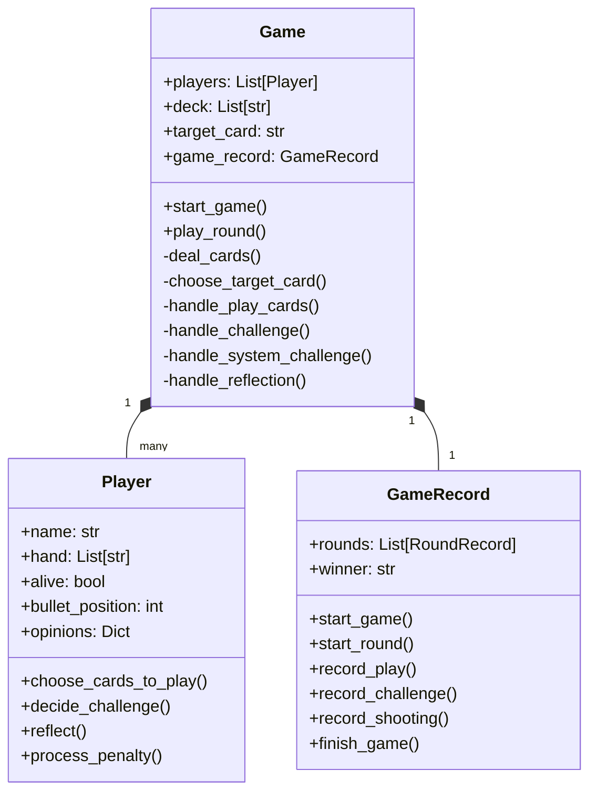

# Liars Bar LLM

一个由大语言模型驱动的AI版骗子酒馆对战框架

## 文件结构

程序主要分为两部分，游戏主体和分析工具

Directory Structure
.
├── Core Game Components
│   ├── game.py                    # Main game logic and rules
│   ├── player.py                  # Player behavior and decision making
│   └── llm_client.py             # LLM API integration
├── Record Management
│   ├── game_record.py            # Game state recording
│   └── json_convert.py           # Record format conversion
├── Analysis Tools
│   ├── game_analyze.py           # Game statistics analysis
│   ├── player_matchup_analyze.py # Player matchup analysis
│   └── multi_game_runner.py      # Multiple game execution
├── prompt/                       # LLM prompt templates
│   ├── challenge_prompt_template.txt
│   ├── play_card_prompt_template.txt
│   ├── reflect_prompt_template.txt
│   └── rule_base.txt
└── demo_records/                 # Game record storage
    ├── game_records/            # JSON format records
    ├── converted_game_records/  # Text format records
    └── matchup_records/        # Player matchup analysis

# Key Components

1. **Core Game Components**:
   - `game.py`: Manages game flow, rules, card dealing, and round management
   - `player.py`: Handles player actions, decision making, and interaction with LLMs
   - `llm_client.py`: Interfaces with LLM APIs for player decisions

2. **Game Record Management**:
   - `game_record.py`: Records game states, actions, and outcomes
   - `json_convert.py`: Converts JSON records to readable text format

3. **Analysis Tools**:
   - `game_analyze.py`: Analyzes game statistics and outcomes
   - `player_matchup_analyze.py`: Analyzes player vs player performance
   - `multi_game_runner.py`: Runs multiple games for analysis

4. **Support Directories**:
   - `prompt/`: Contains templates for LLM interactions
   - `demo_records/`: Stores game records in various formats

The system is designed to:
1. Run card games between different LLM models
2. Record detailed game states and decisions
3. Analyze performance and strategies
4. Convert game records to human-readable format
5. Track player matchups and statistics

Each component is modular and serves a specific purpose in the overall game system architecture.

## Game Logic

### Overview
The game "Liars Bar LLM" is a card-based bluffing game where multiple LLM agents compete against each other. The game involves strategic card play, bluffing, and decision-making about when to challenge other players' moves.

### Game Components
- **Card Deck**: 
  - 6x Q (Queens)
  - 6x K (Kings)
  - 6x A (Aces)
  - 2x Jokers

### Gameplay Mechanics

1. **Round Setup**
   - Each player receives 5 cards
   - A target card (Q, K, or A) is randomly selected
   - Players must play cards matching the target (Jokers allowed)

2. **Turn Structure**
   - Current player plays one or more cards
   - Next player can either:
     - Challenge the play (claiming cards don't match target)
     - Pass (accept the play and continue game)

3. **Challenging System**
   - If challenged:
     - Valid play: Challenger faces penalty
     - Invalid play: Current player faces penalty
   - System auto-challenges when all other players are out of cards

4. **Penalty System**
   - Players have a "gun" with one bullet in random position
   - When penalized, player must "shoot"
   - If bullet position matches, player is eliminated
   - Gun position advances after each shot

5. **Memory and Strategy**
   - Players maintain opinions about other players
   - Reflection phase after each round
   - Strategic decision-making based on:
     - Previous plays
     - Player behavior patterns
     - Card probabilities
     - Risk assessment

6. **Victory Condition**
   - Game ends when only one player remains alive
   - Last surviving player wins the game

### Advanced Features

1. **Player Intelligence**
   - Each LLM agent maintains:
     - Hand knowledge
     - Player behavior history
     - Strategic assessments
     - Adaptive gameplay based on observations

2. **Game Recording**
   - Detailed record-keeping of:
     - All card plays
     - Challenge decisions
     - Player eliminations
     - Round outcomes
     - Player reflections

3. **Analysis System**
   - Post-game analysis capabilities
   - Player matchup statistics
   - Strategy effectiveness tracking
   - Behavioral pattern recognition

### Integrated Game Logic and Implementation Flow

```mermaid
graph TD
    %% Game Initialization
    A[Game Start] -->|Game.start_game()| B[Deal Cards]
    B -->|Game.deal_cards()| C[Choose Target Card]
    C -->|Game.choose_target_card()| D[Select Starting Player]
    
    %% Main Game Loop
    D -->|Game.current_player_idx| E[Current Player's Turn]
    
    %% Play Phase
    E -->|Game.play_round()| F{Check Other Players' Cards}
    F -->|Game.check_other_players_no_cards()| G{Has Cards?}
    
    %% No Cards Branch
    G -->|No| H[System Auto-Challenge]
    H -->|Game.handle_system_challenge()| I[Verify Cards]
    
    %% Has Cards Branch
    G -->|Yes| J[Player Plays Cards]
    J -->|Game.handle_play_cards()| K[Next Player Decision]
    K -->|Player.decide_challenge()| L{Challenge?}
    
    %% Challenge Resolution
    L -->|Yes| M[Verify Play]
    L -->|No| N[Next Player's Turn]
    
    M -->|Game.is_valid_play()| O{Valid Play?}
    
    %% Penalty Phase
    O -->|Yes| P[Penalize Challenger]
    O -->|No| Q[Penalize Current Player]
    
    P -->|Game.perform_penalty()| R[Check Victory]
    Q -->|Game.perform_penalty()| R
    N -->|Game.find_next_player_with_cards()| R
    
    %% Game State Check
    R -->|Game.check_victory()| S{Game Over?}
    S -->|No| T[Reset Round]
    S -->|Yes| U[End Game]
    
    %% Round Reset
    T -->|Game.reset_round()| V[Reflection Phase]
    V -->|Game.handle_reflection()| B
    
    %% Record Keeping Through GameRecord
    subgraph Record Management
        RM1[Start Round] -->|GameRecord.start_round()| RM2[Record Play]
        RM2 -->|GameRecord.record_play()| RM3[Record Challenge]
        RM3 -->|GameRecord.record_challenge()| RM4[Record Shooting]
        RM4 -->|GameRecord.record_shooting()| RM5[Update Round]
    end
    
    %% Player State Management
    subgraph Player Actions
        PA1[Choose Cards] -->|Player.choose_cards_to_play()| PA2[Make Challenge]
        PA2 -->|Player.decide_challenge()| PA3[Process Penalty]
        PA3 -->|Player.process_penalty()| PA4[Reflect]
        PA4 -->|Player.reflect()| PA1
    end

    classDef gameClass fill:#f9f,stroke:#333,stroke-width:2px;
    classDef playerClass fill:#bbf,stroke:#333,stroke-width:2px;
    classDef recordClass fill:#bfb,stroke:#333,stroke-width:2px;
    
    class A,B,C,D,E,F,G,H,I,J,K,M,N,O,P,Q,R,S,T,U gameClass;
    class PA1,PA2,PA3,PA4 playerClass;
    class RM1,RM2,RM3,RM4,RM5 recordClass;
```

### Code Structure



### Function Structure Tree
```
game.py
├── Game Class
│   ├── Game Flow Management
│   │   ├── start_game()                    # Main game loop
│   │   ├── play_round()                    # Single round execution
│   │   └── reset_round()                   # Round reset handling
│   │
│   ├── Game Setup
│   │   ├── _create_deck()                 # Deck initialization
│   │   ├── deal_cards()                   # Card distribution
│   │   └── choose_target_card()           # Target card selection
│   │
│   ├── Game Logic Handlers
│   │   ├── handle_play_cards()            # Card play processing
│   │   ├── handle_challenge()             # Challenge processing
│   │   ├── handle_system_challenge()      # Auto-challenge handling
│   │   └── handle_reflection()            # End-round reflection
│   │
│   ├── State Validation
│   │   ├── is_valid_play()               # Card play validation
│   │   ├── check_victory()               # Win condition check
│   │   └── check_other_players_no_cards()# Hand emptiness check
│   │
│   └── Player Management
│       ├── find_next_player_with_cards() # Next player selection
│       └── perform_penalty()             # Penalty execution

player.py
├── Player Class
│   ├── Game Interaction
│   │   ├── choose_cards_to_play()        # Card selection logic
│   │   ├── decide_challenge()            # Challenge decision
│   │   └── process_penalty()             # Penalty handling
│   │
│   ├── State Management
│   │   ├── init_opinions()               # Opinion initialization
│   │   └── reflect()                     # Strategy updating
│   │
│   └── Utilities
│       └── print_status()                # Status display

game_record.py
├── GameRecord Class
│   ├── Game State Recording
│   │   ├── start_game()                  # Game initialization
│   │   ├── start_round()                 # Round start recording
│   │   └── finish_game()                 # Game completion
│   │
│   ├── Action Recording
│   │   ├── record_play()                 # Play action logging
│   │   ├── record_challenge()            # Challenge logging
│   │   └── record_shooting()             # Shooting result logging
│   │
│   └── Information Retrieval
│       ├── get_latest_round_info()       # Round info access
│       ├── get_latest_round_actions()    # Action history
│       └── get_play_decision_info()      # Decision context
```

### Implementation Details

1. **Game Flow Control**
   - `Game.start_game()`: Main game loop controller
   - `Game.play_round()`: Individual round execution
   - `Game.reset_round()`: Round state reset and preparation

2. **Player Actions**
   - `Player.choose_cards_to_play()`: Card selection with strategy
   - `Player.decide_challenge()`: Challenge decision making
   - `Player.process_penalty()`: Handle shooting penalty
   - `Player.reflect()`: Update strategy based on round results

3. **Game State Management**
   - `Game.check_victory()`: Win condition verification
   - `Game.is_valid_play()`: Card play validation
   - `Game.check_other_players_no_cards()`: Game state check
   - `Game.find_next_player_with_cards()`: Turn management

4. **Record Keeping**
   - `GameRecord.start_round()`: Initialize round records
   - `GameRecord.record_play()`: Log player actions
   - `GameRecord.record_challenge()`: Track challenges
   - `GameRecord.record_shooting()`: Document penalties

### 游戏主体

`game.py` 骗子酒馆游戏主程序

`player.py` 参与游戏的LLM智能体

`game_record.py` 用于保存和提取游戏记录

`llm_client.py` 用于配置模型接口和发起LLM请求

`multi_game_runner.py` 用于批量运行多轮游戏

### 分析工具

`game_analyze.py` 用于统计所有对局数据

`player_matchup_analyze.py` 用于提取互为对手的AI间的对局记录进行分析

`json_convert.py` 用于将json游戏记录转为可读文本

## 配置

推荐使用 uv 作为包管理工具:

```bash
curl -LsSf https://astral.sh/uv/install.sh | sh
```

安装依赖包：

```bash
uv pip install openai python-dotenv
```

本项目的API配置在`llm_client.py`中。

本项目利用了New API https://github.com/Calcium-Ion/new-api?tab=readme-ov-file 配置了统一的接口调用格式。使用时需自行配置相应模型的API接口。

也可以采用类似的API管理项目One API https://github.com/songquanpeng/one-api 实现统一的接口调用。

## 使用方法

### 运行

完成项目配置后，在`game.py`和`multi_game_runner.py`主程序入口的`player_configs`中设置正确的模型名称

运行单局游戏：
```
python game.py
```

运行多局游戏：
```
python multi_game_runner.py -n 10
```
在`-n`后指定你希望运行的游戏局数，默认为10局

### 分析

游戏记录会以json形式保存在目录下的`game_records`文件夹中

将json文件转为可读性更强的文本格式，转换后的文件会保存在目录下的`converted_game_records`文件夹中

```
python json_convert.py
```

提取所有游戏中AI之间两两对决的对局，转换后的文件会保存在目录下的`matchup_records`文件夹中

```
python player_matchup_analyze.py
```

统计并打印所有的对局数据

```
python game_analyze.py
```

## Demo

项目已将 DeepSeek-R1、o3-mini、Gemini-2-flash-thinking、Claude-3.7-Sonnet 四个模型作为玩家运行了50局，记录存放在`demo_records`文件夹中。

## 已知问题

模型在出牌和质疑阶段的输出可能不稳定，当输出无法满足游戏规定时，会自动重试。如果多次因为输出问题中断运行，可在`player.py`的`choose_cards_to_play`和`decide_challenge`中增加调用大模型的重试次数，或修改`prompt`文件夹中的`play_card_prompt_template.txt`和`challenge_prompt_template.txt`提示词强化对输出格式的限制（可能对模型的推理能力有一定影响）。
