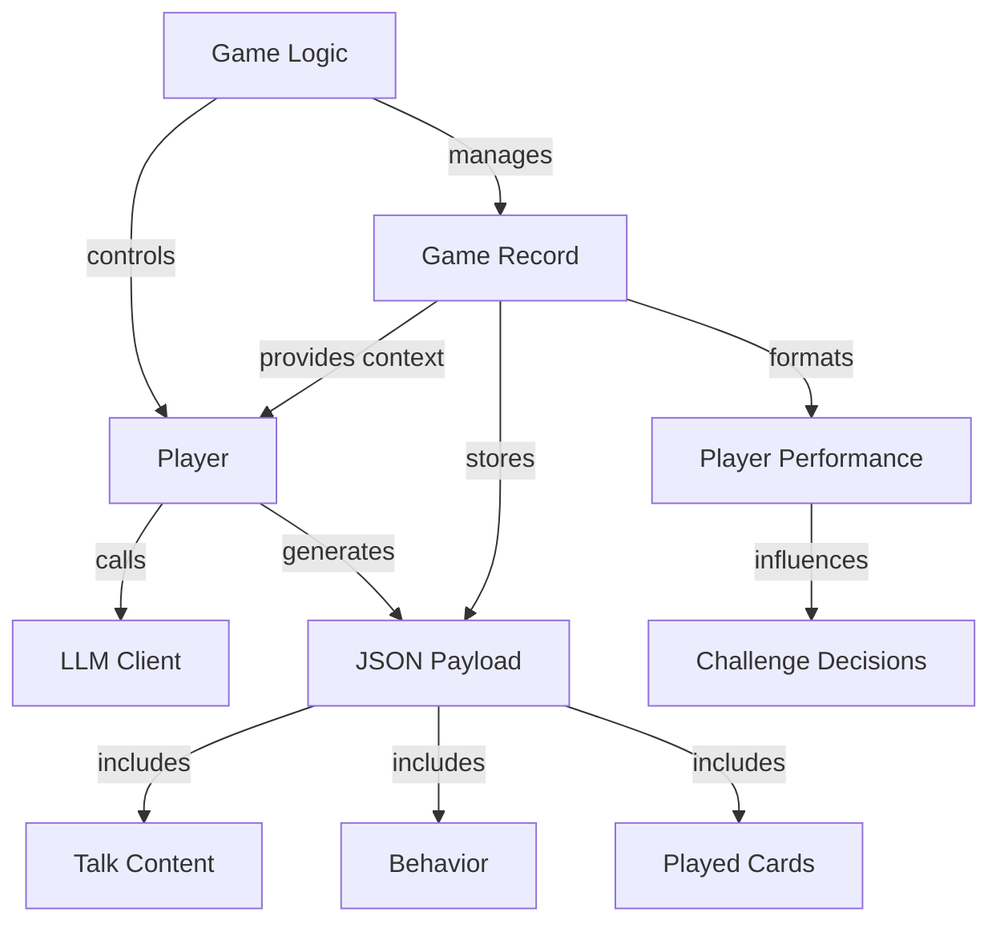
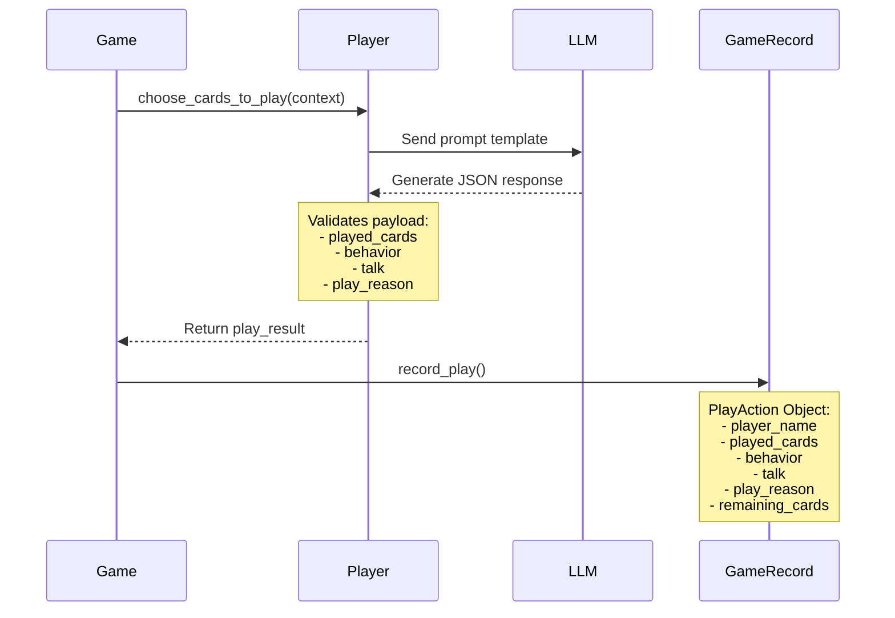
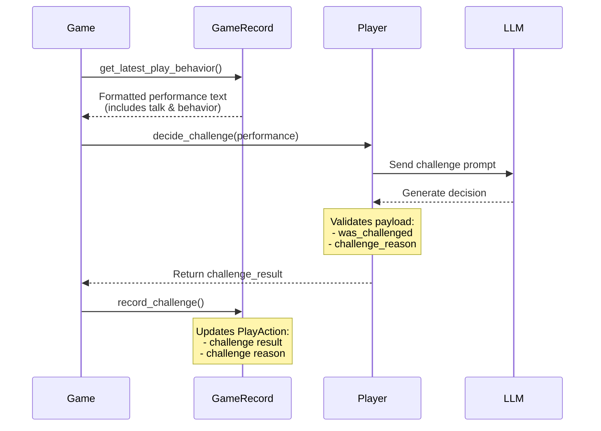

# Game Architecture

## Component Overview




## Data Flow

### Play Cards Flow




### Challenge Flow




## Key Components

### Game Logic (game.py)
- Manages game flow and rules
- Coordinates between players
- Controls round progression
- Handles system challenges
- Delegates record keeping to GameRecord

### Player (player.py)
- Interfaces with LLM
- Generates decisions through prompts
- Validates LLM responses
- Manages player state (hand, opinions)
- Makes play and challenge decisions

### Game Record (game_record.py)
- Stores game state and history
- Tracks player actions and results
- Provides context for decisions
- Formats action summaries
- Maintains persistent record

### Payloads

#### Play Card Payload
```json
{
    "played_cards": ["K", "K"],
    "behavior": "nervously shuffles cards",
    "talk": "I'm confident these are the right cards",
    "play_reason": "strategic decision explanation"
}
```

#### Challenge Payload
```json
{
    "was_challenged": true,
    "challenge_reason": "explanation for challenge decision"
}
```

## Context Generation

### For Play Decisions
1. Game provides:
   - Round base info (current round, target card)
   - Round action history
   - Play decision context
2. Record formats:
   - Previous plays
   - Player behaviors
   - Player dialogue
   - Challenge outcomes

### For Challenge Decisions
1. Game provides:
   - Round base info
   - Action history
   - Challenge decision context
   - Previous player's performance
2. Record formats:
   - Player actions
   - Behaviors
   - Dialogue
   - Current game state

## Information Flow
1. Game initiates action
2. Player receives context
3. Player generates decision
4. Game validates action
5. Record stores result
6. Record provides context for next decision

This architecture ensures:
- Clean separation of concerns
- Persistent game state
- Rich context for decisions
- Traceable player actions
- Structured data flow
